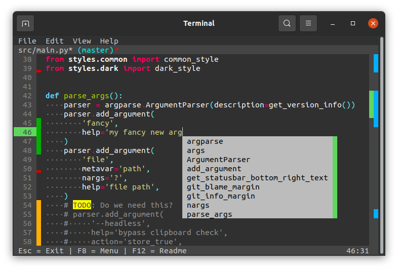

# affe - a full-fledged editor 🐵

```text
                 __,__
        .--.  .-"     "-.  .--.
       / .. \/  .-. .-.  \/ .. \
      | |  '|  /   Y   \  |'  | |
      | \   \  \ 0 | 0 /  /   / |
       \ '- ,\.-"`` ``"-./, -' /
        `'-' /_   ^ ^   _\ '-'`
        .--'|  \._   _./  |'--.
      /`    \   \ `~` /   /    `\
     /       '._ '---' _.'       \     The more features an application
    /           '~---~'   |       \    provides, the harder will people
   /        _.             \       \   actually start using it.
  /   .'-./`/        .'~'-.|\       \
 /   /    `\:       /      `\'.      \        - An unknown monkey (2019)
/   |       ;      |         '.`;    /
\   \       ;      \           \/   /
 '.  \      ;       \       \   `  /
   '._'.     \       '.      |   ;/_
     /__>     '.       \_ _ _/   ,  '--.
   .'   '.   .-~~~~~-. /     |--'`~~-.  \
  // / .---'/  .-~~-._/ / / /---..__.'  /
 ((_(_/    /  /      (_(_(_(---.__    .'
           | |     _              `~~`
           | |     \'.
            \ '....' |
             '.,___.'
```

`affe` is a simple text editor enhanced with some fancy features.
Its goal is to be a user-friendly terminal-based editor.

**Screenshot:**


## Contents

* [List of Features](#list-of-features)
* [Quickstart](#quickstart)
* [Keyboard shortcuts](#keyboard-shortcuts)
* [FAQ](#faq)
* [Known Limitations](#known-limitations)
* [Bonus](#bonus)

## List of Features

* 📝 Text editor (wow!)
* 🎨 Syntax highlighting (fancy)
* ⚙️ Fuzzy Auto-Completion (this is aweso `Ctrl+Space`)
* 🔧 Inline git diff, git blame & git minimap (pretty useful)
* 🔤 Text selection (using mouse or `Shift+Arrow Keys`)
* ⌨️ Easy to remember keyboard shortcuts (`Esc` to exit, `Ctrl+C` to copy, `Ctrl+A` to select all, `Ctrl+S` to save)
* 🖱️ Mouse support (scrolling, clicking, text selection)
* 🔎 Find-and-replace functionality

## Quickstart

Grab the latest binary from [affe.sh](https://affe.sh) or build it yourself:

**Ubuntu 18.04 or newer:**

```sh
git clone https://github.com/Leistungsabfall/affe.git
cd affe
./scripts/linux/setup.sh
./scripts/linux/build.sh
```

**Git Bash for Windows:**

Note: You will need admin rights.

Run the following commands in [Git Bash for Windows](https://git-scm.com/install/windows):

```sh
git clone https://github.com/Leistungsabfall/affe.git
cd affe
scripts/windows/setup.bat
scripts/windows/build.bat
```

## Keyboard shortcuts

All keyboard shortcuts are designed with the intent to be intuitive.
So you may already know most of them from Notepad++ or your favorite IDE.

### Basic

| Key Combination | Function                                               |
|-----------------|--------------------------------------------------------|
| `Esc`           | Exit                                                   |
| `Ctrl+S`        | Save                                                   |
| `Ctrl+Z`        | Undo                                                   |
| `Ctrl+Y`        | Redo                                                   |
| `Ctrl+C`        | Copy (if nothing is selected the whole line is copied) |
| `Ctrl+V`        | Paste                                                  |
| `Ctrl+X`        | Cut  (if nothing is selected the whole line is cut)    |
| `Ctrl+A`        | Select all                                             |
| `Ctrl+F`        | Open Find toolbar                                      |
| `Ctrl+R`        | Open Replace toolbar                                   |

### Advanced

| Key Combination   | Function                            |
|-------------------|-------------------------------------|
| `Ctrl+Space`      | Open Auto-Completion                |
| `Ctrl+K`          | Comment/Uncomment                   |
| `Tab/Shift+Tab`   | Indent/Un-indent selected lines     |
| `Ctrl+Left/Right` | Jump to previous/next word          |
| `Ctrl+Up/Down`    | Move line(s) up/down                |
| `Shift+Arrow Key` | Select text                         |
| `Ctrl+W`          | Select word under cursor            |
| `Ctrl+N`          | Jump to beginning of next line      |
| `Ctrl+T`          | Toggle upper/lower case             |
| `Ctrl+G`          | Reset file to version stored in git |
| `Ctrl+B`          | Toggle inline git blame view        |
| `F7`              | Open menu                           |
| `F12`             | Show readme document                |

# FAQ

* What does `affe` mean?
  * `affe` is an acronym for **A** **F**ull- **F**ledged **E**ditor.


* Why not use `vim`/`nano`/...?
  * Their keyboard shortcuts are hard to remember: [How do I exit Vim?](https://stackoverflow.com/questions/11828270/how-do-i-exit-vim)
    and many of those editors lack proper syntax highlighting.
    And no, I don't want to install plugins for those basic features.


* Why not use a graphical editor?
  * Using a graphical editor via Remote Desktop sucks.
    A terminal-based editor is much more responsive while saving bandwidth and power on the client system.


* Why yet another text editor?
  * `affe` aims to be very user-friendly while still being a terminal-based text editor.
    It is possible to control `affe` completely mouse-driven so you can start right away.
    And keyboard shortcuts are designed to be intuitive.


* Which programming languages are supported for syntax highlighting?
  * `affe` uses the [pygments](https://pygments.org/) library for syntax highlighting. 
    This means that all languages and file formats supported by pygments (currently **~600**) are also supported by affe.


* What are those blue lines right next to the scrollbar?
  * This is the git minimap. It indicates modified lines throughout the whole file. Pretty neat, huh?


* The default blinking block cursor (`█`) feels wrong in an editor. Can it be changed to a line cursor (`|`)?
  * Yes, for most terminals this can be changed in the preferences.
    Look for a `Cursor Shape` option and change it accordingly.


* Why are all lines in my file marked as modified by git?
  * I bet your file uses `CRLF` line endings (Windows) instead of `LF` (everyone else). This confuses `affe`.


* Why are modified lines in my file not highlighted by git?
  * Is your file tracked by `git`? If yes, then your file probably uses an unsupported encoding.
    Check the output of this command: `file <yourfile>`.


* Why is Copy/Paste not working when using sudo?
  * Run `xhost local:$USER`


* Why do I see weird `?` characters all over the place?
  * Enable `UTF-8` support by running the following command in the terminal: `export LC_ALL=C.UTF-8`


* How can I use `affe` as the default editor, e.g. for `git commit` messages?
  * Run the following command: `git config --global core.editor "affe"`
    You can also set the `EDITOR` environment variable accordingly.

## Using affe remotely via SSH on a Windows host

* How can I **copy** text **from** `affe` when using `git bash`, `PuTTY`, ...?
  * Hold down `Shift` and select text with your mouse.
    This is far from perfect, so don't forget to remove any line numbers when pasting `¯\_(ツ)_/¯`


* How can I **paste** text **into** `affe` when using `git bash`, `PuTTY`, ...?
  * Press `Ctrl+Shift+V` (default for most terminal emulators after disabling the scroll modifier, see below).


* What's the best way to use `byobu` and `git bash` in combination?
  1. Open `Options` in `git bash`
  2. Disable the scroll modifier in `Window` settings
  3. Enable `Ctrl+Shift+Letter shortcuts` in `Keys` settings
  4. In `byobu` press `F9` and change escape sequence to `Ctrl+E`
  5. Add the following lines to `~/.config/byobu/.tmux.conf` and `~/.config/byobu/keybindings.tmux`:
    ```
    unbind-key -n S-Up
    unbind-key -n S-Down
    unbind-key -n S-Left
    unbind-key -n S-Right
    unbind-key -n F7
    set -g mouse on
    set -g default-terminal "xterm"
    ```

    (as always, hold down `Shift` to select text with your mouse)

# Known Limitations

## General

`affe` is primarily developed and tested on Ubuntu 18.04 and newer.
Some features (especially during installation/setup) may not work as expected on other systems.

`affe` uses the `python-prompt-toolkit` library, which offers great customizability at the cost of performance.
On very large files (e.g. > 10,000 lines) some operations may feel sluggish.
Also, startup time may be longer than expected.
This performance impact is especially noticeable when trying to run `affe` (please don't) on low-end hardware (e.g. Raspberry Pi).

CPU usage is generally higher than one might expect for a terminal-based editor.
This is mainly due to the usage of `python-prompt-toolkit`, but also caused by the convenience features that run continuously in the background:
* Update syntax highlighting
* Check for external file modifications
* Update git inline diff and minimap

## Windows

Support for Windows using `git bash` is experimental.

Some features may not work as expected, for example:
* Pressing `Ctrl+Space` does not open the auto-completion menu.
* Git inline diff is not shown.
* Newline at end of file is not added automatically when saving.
* Whitespace at end of line is not stripped when saving.

# Bonus

Congratulations! You have reached the end of this readme.

Here are two Easter eggs for you:
* Run `affe chess.py` to play a game of chess against the [sunfish](https://github.com/thomasahle/sunfish) engine.
* Run `affe <file>.paint` to open a simple painting application.
