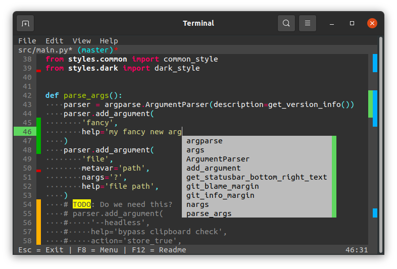

# affe - a full-fledged editor 🐵

[](https://github.com/Leistungsabfall/affe/actions/workflows/tests.yml)
[](https://github.com/Leistungsabfall/affe/releases/latest)
[](https://www.python.org/downloads)
[](https://affe.sh)

```text
                 __,__
        .--.  .-"     "-.  .--.
       / .. \/  .-. .-.  \/ .. \
      | |  '|  /   Y   \  |'  | |
      | \   \  \ 0 | 0 /  /   / |
       \ '- ,\.-"`` ``"-./, -' /
        `'-' /_   ^ ^   _\ '-'`
        .--'|  \._   _./  |'--.
      /`    \   \ `~` /   /    `\
     /       '._ '---' _.'       \     The more features an application
    /           '~---~'   |       \    provides, the harder will people
   /        _.             \       \   actually start using it.
  /   .'-./`/        .'~'-.|\       \
 /   /    `\:       /      `\'.      \        - An unknown monkey (2019)
/   |       ;      |         '.`;    /
\   \       ;      \           \/   /
 '.  \      ;       \       \   `  /
   '._'.     \       '.      |   ;/_
     /__>     '.       \_ _ _/   ,  '--.
   .'   '.   .-~~~~~-. /     |--'`~~-.  \
  // / .---'/  .-~~-._/ / / /---..__.'  /
 ((_(_/    /  /      (_(_(_(---.__    .'
           | |     _              `~~`
           | |     \'.
            \ '....' |
             '.,___.'
```

`affe` is a simple text editor enhanced with some fancy features.
Its goal is to be a user-friendly terminal-based editor.

**Screenshot:**


## Contents

* [List of Features](#list-of-features)
* [Quickstart](#quickstart)
* [Keyboard shortcuts](#keyboard-shortcuts)
* [FAQ](#faq)
* [Known Limitations](#known-limitations)
* [Bonus](#bonus)

## List of Features

* 📝 Text editor (wow!)
* 🎨 Syntax highlighting (fancy)
* ⚙️ Fuzzy Auto-Completion (this is aweso `Ctrl+Space`)
* 🔧 Inline git diff, git blame & git minimap (pretty useful)
* 🔤 Text selection (using mouse or `Shift+Arrow Keys`)
* ⌨️ Easy to remember keyboard shortcuts (`Esc` to exit, `Ctrl+C` to copy, `Ctrl+A` to select all, `Ctrl+S` to save)
* 🖱️ Mouse support (scrolling, clicking, text selection)
* 🔎 Find-and-replace functionality

## Quickstart

Install the latest release from [affe.sh](https://affe.sh) or run `affe` from source:

**Prerequisites:**

* **OS:** Linux or macOS
* **Python** 3.10 or higher
* **Packages:**
  * `git` (for git integration features)
  * `xclip` (X11) or `wl-clipboard` (Wayland) (optional, for non-headless Linux systems to use the system clipboard)

```sh
git clone https://github.com/Leistungsabfall/affe.git
cd affe
python3.14 -m venv env # Replace python3.14 with your python version
. env/bin/activate
python -m pip install --upgrade pip
pip install -r requirements.txt
```

Then, to start `affe`, run:

```sh
python src/main.py
```

To make `affe` available as a command, run:

```sh
./scripts/install.sh dist
cd dist
python3.14 -m venv env # Replace python3.14 with your python version
. env/bin/activate
python -m pip install --upgrade pip
pip install -r res/requirements.txt
deactivate
```

Then, add the following line to your shell profile file (e.g. `~/.profile` or `~/.zprofile`):

```sh
export PATH="$PATH:<path-to-dist-folder>" # Replace <path-to-dist-folder> with the actual path to the dist folder
```

After that, restart your terminal or run the above export command.

You can now start `affe` by simply running `affe` in the terminal.

To use `affe` with `sudo`, create a symlink:

```sh
sudo ln -sf <path-to-dist-folder>/affe /usr/local/bin/affe
```

To set `affe` as your default editor, run:

```sh
git config --global core.editor affe
```

and add the following line to your shell profile file (e.g. `~/.profile` or `~/.zprofile`):

```sh
export EDITOR="affe"
```

## Keyboard shortcuts

All keyboard shortcuts are designed with the intent to be intuitive.
So you may already know most of them from Notepad++ or your favorite IDE.

### Basic

| Key Combination | Function                                               |
|-----------------|--------------------------------------------------------|
| `Esc`           | Exit                                                   |
| `Ctrl+S`        | Save                                                   |
| `Ctrl+Z`        | Undo                                                   |
| `Ctrl+Y`        | Redo                                                   |
| `Ctrl+C`        | Copy (if nothing is selected the whole line is copied) |
| `Ctrl+V`        | Paste                                                  |
| `Ctrl+X`        | Cut  (if nothing is selected the whole line is cut)    |
| `Ctrl+A`        | Select all                                             |
| `Ctrl+F`        | Open Find toolbar                                      |
| `Ctrl+R`        | Open Replace toolbar                                   |

### Advanced

| Key Combination   | Function                            |
|-------------------|-------------------------------------|
| `Ctrl+Space`      | Open Auto-Completion                |
| `Ctrl+K`          | Comment/Uncomment                   |
| `Tab/Shift+Tab`   | Indent/Un-indent selected lines     |
| `Ctrl+Left/Right` | Jump to previous/next word          |
| `Ctrl+Up/Down`    | Move line(s) up/down                |
| `Shift+Arrow Key` | Select text                         |
| `Ctrl+W`          | Select word under cursor            |
| `Ctrl+N`          | Jump to beginning of next line      |
| `Ctrl+T`          | Toggle upper/lower case             |
| `Ctrl+G`          | Reset file to version stored in git |
| `Ctrl+B`          | Toggle inline git blame view        |
| `F7`              | Open menu                           |
| `F12`             | Show readme document                |

## FAQ

* What does `affe` mean?
  * `affe` is an acronym for **A** **F**ull- **F**ledged **E**ditor.
     Also, `affe` means "monkey" in German. Monkeys are cool.

* How to pronounce `affe`?
  * IPA: `[ˈafə]` (`af` like in "Muffin", `fe` like in "feather")

* Why not use `vim`/`nano`/...?
  * Their keyboard shortcuts are hard to remember: [How do I exit Vim?](https://stackoverflow.com/questions/11828270/how-do-i-exit-vim)
    and many of those editors lack proper syntax highlighting.
    And no, I don't want to install plugins for those basic features.

* Why not use a graphical editor?
  * Using a graphical editor is unnecessary overhead for quickly editing system config files.
    Also, it sucks to use a graphical editor on a remote server.
    A terminal-based editor is much more responsive while saving bandwidth and power on the client system.

* Why yet another text editor?
  * `affe` aims to be very user-friendly while still being a terminal-based text editor.
    It is possible to control `affe` completely mouse-driven so you can start right away.
    And keyboard shortcuts are designed to be intuitive.

* Which programming languages are supported for syntax highlighting?
  * `affe` uses the [pygments](https://pygments.org/) library for syntax highlighting.
    This means that all languages and file formats supported by pygments (currently **~600**) are also supported by affe.

* What are those blue lines right next to the scrollbar?
  * This is the git minimap. It indicates modified lines throughout the whole file. Pretty neat, huh?

* Why is `affe` not found when using `sudo affe`?
  * `sudo` does not inherit the user's `PATH` environment variable.
  Create a symlink: `sudo ln -s $(which affe) /usr/local/bin/affe`.

* Why is `Ctrl+Arrow Down` and `Ctrl+Arrow Up` not working?
  * This is a known issue on macOS. The `Ctrl+Arrow Down` and `Ctrl+Arrow Up` keybindings are reserved by the system for switching between spaces.
    You can change this in the system preferences: `System Preferences > Keyboard > Shortcuts > Mission Control`:
    Select the `Mission Control` and `Program Windows` options and uncheck them or change the keybindings to something else (e.g. `Ctrl+Shift+Arrow Down` and `Ctrl+Shift+Arrow Up`).

* Why is the `Ctrl+Space` auto-completion not working?
  * This is a known issue on macOS. The `Ctrl+Space` keybinding is reserved by the system for switching input sources.
    You can change this in the system preferences: `System Preferences > Keyboard > Shortcuts > Input Sources`:
    Select the `Select the previous input source` option and uncheck it or change the keybinding to something else (e.g. `Ctrl+Shift+Space`).

* The default blinking block cursor (`█`) feels wrong in an editor. Can it be changed to a line cursor (`|`)?
  * Yes, for most terminals this can be changed in the preferences.
    Look for a `Cursor Shape` option and change it accordingly.

* Why are all lines in my file marked as modified by git?
  * I bet your file uses `CRLF` line endings (Windows) instead of `LF` (everyone else). This confuses `affe`.

* Why are modified lines in my file not highlighted by git?
  * Is your file tracked by `git`? If yes, then your file probably uses an unsupported encoding.
    Check the output of this command: `file <yourfile>`.

* Why do I see weird `?` characters all over the place?
  * Enable `UTF-8` support by running the following command in the terminal: `export LC_ALL=C.UTF-8`

## Known Limitations

`affe` is primarily developed and tested on Ubuntu.
Some features may not work as expected on other systems.

`affe` uses the awesome [python-prompt-toolkit](https://github.com/prompt-toolkit/python-prompt-toolkit) library, which offers great customizability at the cost of performance.
On very large files (e.g. > 10,000 lines) some operations may feel sluggish.
Also, startup time may be longer than expected.
This performance impact is especially noticeable when trying to run `affe` (please don't) on low-end hardware (e.g. Raspberry Pi).

CPU usage is generally higher than one might expect for a terminal-based editor.
This is mainly due to the usage of python-prompt-toolkit, but also caused by the convenience features that run continuously in the background:

* Update syntax highlighting
* Check for external file modifications
* Update git inline diff and minimap

## Bonus

Congratulations! You have reached the end of this readme.

Here are two Easter eggs for you:

* Run `affe chess.py` to play a game of chess against the [sunfish](https://github.com/thomasahle/sunfish) engine.
* Run `affe <file>.paint` to open a simple painting application.
